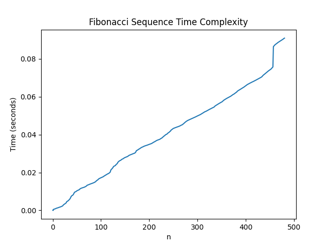

# Fibonacci Sequence Performance Analysis

Echo.py includes a Python program that takes a user input and prints the echo of the input back.

Fib.py includes a Python script that calculates the Fibonacci sequence up to the 480th number that demonstrates the use of a decorator function 'wrapper' using lru_cache.

